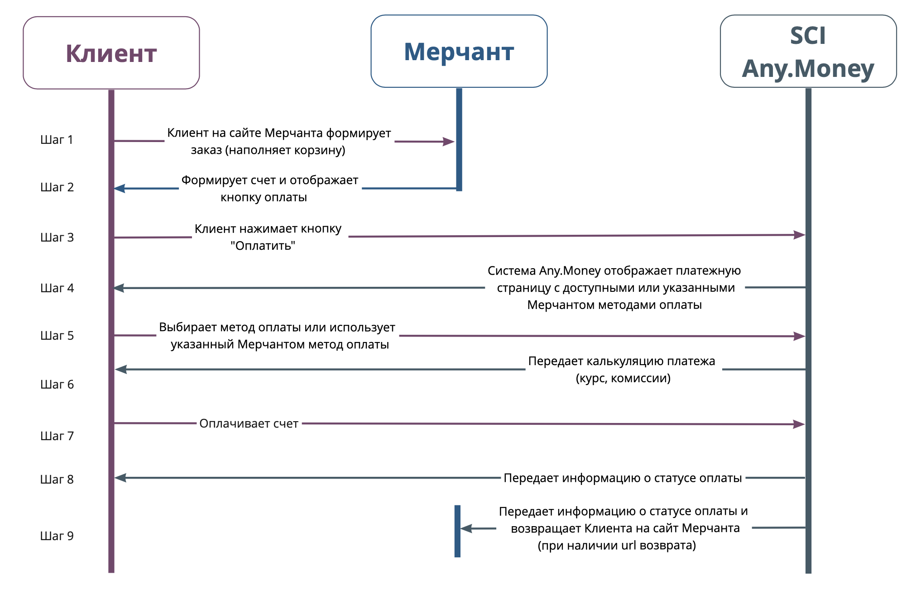

# sci\_start

**Shopping Cart Interface \(SCI\)** - интерфейс, позволяющий принимать платежи от клиентов на сайте продавца используя простую HTML форму для передачи информации.

* Для подключения мерчанту необходимо добавить [веб-форму](sci_invoice.md#web_form) на странице сайта в разделе оплаты.
* Мерчант формирует инвойс, задает все необходимые параметры и подписывает данные в форме секретным ключом.
* Клиент на сайте мерчанта нажимает кнопку `"Оплатить"`, после чего система перенаправляет его на страницу оплаты.
* Результат действий клиента на странице оплаты будет отправлен мерчанту на **callback\_url** \(если он задан\), а сам клиент после завершения взаимодействия будет перенаправлен на **redirect\_url**.

## sci scheme of interaction

Процесс оплаты посредством интерфейса SCI

