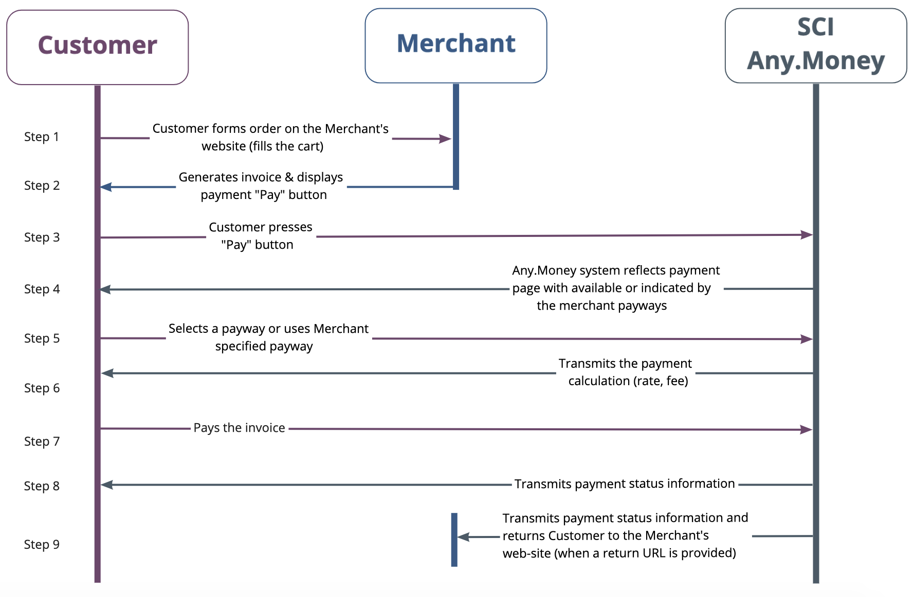

# sci\_start

**Shopping Cart Interface \(SCI\)** - interface for receiving the customers' payments on the seller’s website using a simple HTML form for information transmission.

* To connect to SCI the merchant has to add [a web-form](sci_invoice.md#web_form) at his web-site of the store page in the payment section.
* The merchant construct an invoice, sets all the necessary parameters and then signs the prepared form's data by a secret key.
* On the merchant's website the client clicks the `"Pay"` button and then the system redirects him to the payment page.
* The result of the client’s actions on the payment page will be sent to the merchant by **callback\_url** \(if specified\), and the client will be redirected to **redirect\_url** after the interaction is finished.

## sci interaction scheme

Payment process through the SCI

